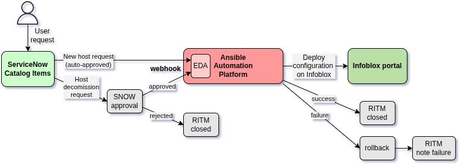
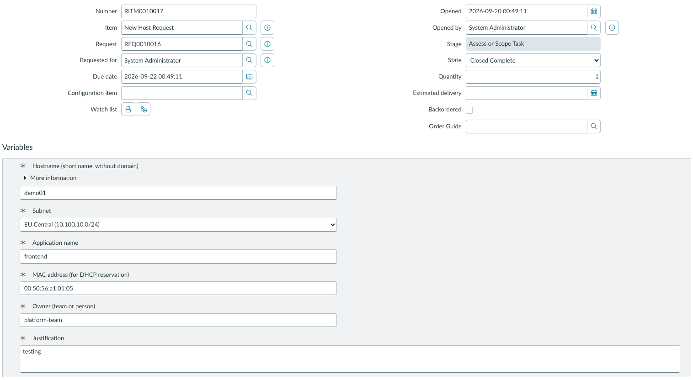
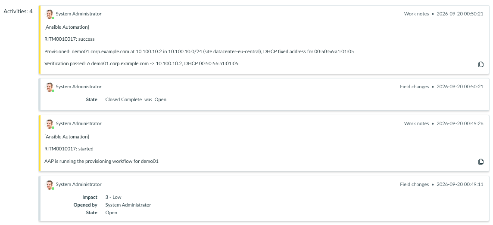
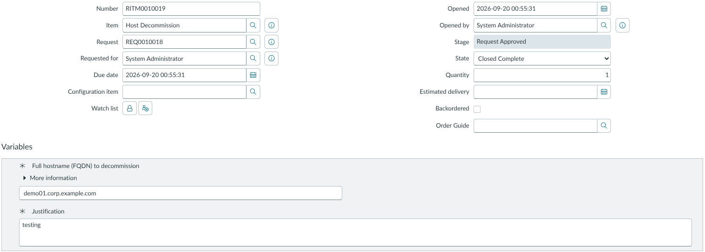
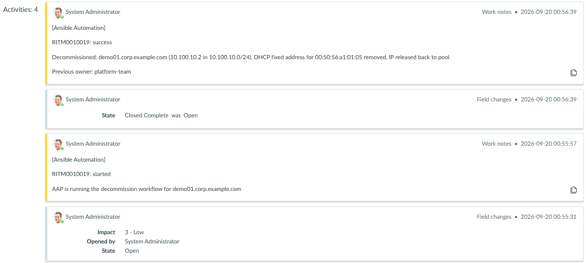

# Event-Driven Ansible for Infoblox and ServiceNow

This project demonstrates how to provision and decommission hosts in Infoblox Universal DDI through ServiceNow requests using Event-Driven Ansible (EDA) and Red Hat Ansible Automation Platform (AAP).

A user submits a ServiceNow catalog request to provision a new host or decommission an existing one. ServiceNow sends an event to EDA in real time, where a matching rule triggers an AAP automation workflow. Ansible performs the requested changes in Infoblox and updates the ServiceNow request with the outcome.

## Architecture

1. A requester submits either a **New Host Request** or **Host Decommission** catalog item in ServiceNow.
2. A **New Host Request** is approved automatically. A **Host Decommission** request remains pending until it is approved. If the request is rejected, ServiceNow closes the Requested Item (RITM).
3. When the RITM approval status changes to `Approved`, ServiceNow sends the request payload to the EDA webhook using an HTTP POST request.
4. The EDA rulebook in `rulebooks/servicenow.yml` identifies the catalog item and launches the corresponding AAP workflow.
5. The workflow updates the Infoblox configuration, verifies the result, rolls back unsuccessful provisioning changes and updates the RITM.

## Workflows Details

### Host Provisioning

1. A user submits a **New Host Request** in ServiceNow.
2. Ansible records in the RITM work notes that the automation workflow has started.
3. Ansible updates the Infoblox configuration:
    - Builds the FQDN from the host name and `default_zone`, defined in `inventory/group_vars/all.yml`.
    - Resolves the zone and subnet (by CIDR) in Infoblox, then the subnet's IP space. The IP space name is used as the `Site` tag.
    - If an A record already exists for the FQDN, reports that the host already exists and makes no changes.
    - Otherwise, allocates the next available IP address while skipping the subnet's first host address (usually reserved for the gateway).
    - Creates the A record and DHCP fixed address. Both objects are tagged with `Owner`, `App`, `Ticket`, `Site`, and `Lifecycle`.
4. Ansible verifies the resulting configuration:
    - Resolves the zone and requested subnet again.
    - Confirms that the A record exists in the expected zone.
    - Confirms that the DHCP fixed address exists at the allocated IP in the subnet's IP space and contains the requested MAC address.
5. On success, Ansible records the outcome in the RITM work notes and changes its state to `Closed Complete`.
6. On failure, Ansible records the outcome in the RITM work notes and leaves the request open.

#### AAP Workflow Job Template for host provisioning
he following diagram shows the automation workflow configured in AAP:

  

### Host Decommissioning

1. A user submits a **Host Decommission** request in ServiceNow. Only the FQDN is required; Ansible resolves all other information from Infoblox.
2. Ansible records in the RITM work notes that the automation workflow has started.
3. Ansible validates the request and retrieves the host details from Infoblox:
    - Resolves the zone and fails if the zone does not exist.
    - Looks up the A record. If it does not exist, reports that the host is already absent and makes no changes.
    - Reads the IP address from the A record, retrieves the IP space and subnet from the corresponding IPAM address.
    - Retrieves the MAC address from the DHCP fixed address, if one exists.
    - Checks whether any CNAME records in the zone point to the host. If they do Ansible refuses to remove the host.
4. Ansible removes the host from Infoblox:
    - Removes the DHCP fixed address, if one exists.
    - Removes the A record.
    - Verifies that the IP address is no longer in use.
5. On success, Ansible records the previous owner and closes the RITM.
6. On failure, Ansible records the outcome in the RITM work notes and leaves the request open.

#### AAP Workflow Job Template for Host Decommissioning

The following diagram shows the automation workflow configured in AAP:

  

## Workflow Records in ServiceNow

The following screenshots show example ServiceNow RITMs for host provisioning and decommissioning. AAP automatically updates each RITM's status and work notes.

### Host Provisioning

  

  

### Host Decommissioning

  

  

## Related project

For Configuration-as-Code approach with declarative, Git-driven management of Infoblox state see this repository <https://github.com/mzdyb/infoblox>.

## Author

[Michal Zdyb](https://www.linkedin.com/in/michal-zdyb-9aa4046/)
